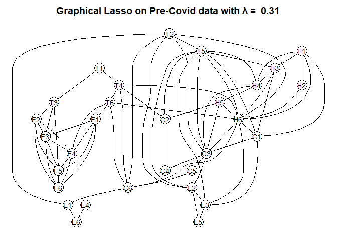
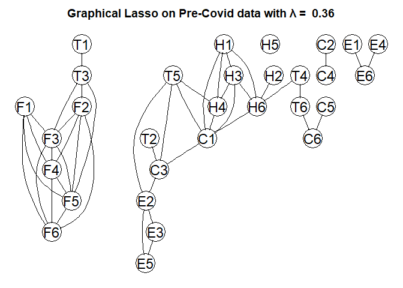
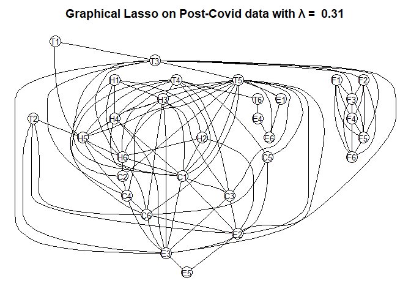

Graphical Lasso on Stock Returns
================
Erin Gregoire,
May 2025

The Graphical Lasso is a useful technique for reducing dimensions in an
unsupervised setting. To demonstrate my skills with this algorithm, I
will perform the Graphical Lasso using daily return data from 30 major
stocks from different sectors (Technology, Finance, Healthcare,
Consumer, and Energy) over a 5-year period.

Preprocessing & Exploratory Data Analysis:

``` r
setwd("~/GitHub/UnsupervisedWithR")
stock_returns <- read.csv("stock_returns_2018_2023.csv", header = TRUE, sep = ",")

stock_returns <- stock_returns[ , -1]
which(is.na(stock_returns) == TRUE)
```

    ##   [1]    74   233   448   755   758   763   832   880   904   928   975  1001
    ##  [13]  1018  1073  1126  1356  1357  1389  1633  1758  1760  1808  1881  1900
    ##  [25]  1967  1970  1972  1982  1987  2038  2243  2271  2338  2377  2387  2584
    ##  [37]  2885  3068  3159  3193  3225  3353  3361  3382  3457  3480  3549  3569
    ##  [49]  3957  3998  4205  4417  4500  4596  4686  4767  4941  4949  5425  5478
    ##  [61]  5548  5576  5667  5912  6010  6196  6204  6590  6645  6709  6788  6801
    ##  [73]  6952  7056  7119  7146  7151  7266  7312  7331  7363  7457  7704  7953
    ##  [85]  8079  8275  8355  8425  8494  8736  8748  8956  9040  9187  9268  9319
    ##  [97]  9515  9561  9564  9572  9579  9638  9716  9768  9771 10091 10106 10172
    ## [109] 10288 10465 10653 10666 10686 10699 10880 10895 10929 11036 11081 11150
    ## [121] 11216 11284 11523 11708 11774 12039 12066 12122 12145 12177 12228 12233
    ## [133] 12317 12383 12463 12536 12544 12608 12653 12859 12959 13027 13073 13118
    ## [145] 13181 13355 13627 13794 14077 14117 14129 14161 14298 14327 14361 14544
    ## [157] 14579 14589 14769 14884 15030 15191 15336 15375 15379 15388 15418 15768
    ## [169] 15855 15886 15933 16034 16045 16074 16128 16212 16228 16388 16541 16662
    ## [181] 16765 16847 17015 17248 17458 17597 17661 17663 17720 17996 18021 18102
    ## [193] 18204 18256 18303 18513 18548 18665 18745 18822 18956 19124 19227 19323
    ## [205] 19561 19619 19795 19995 20069 20108 20180 20217 20421 20470 20509 20645
    ## [217] 20689 21028 21032 21205 21492 21889 21912 22207 22228 22340 22470 22477
    ## [229] 22490 22598 22618 22693 22816 22824 22907 23042 23196 23221 23268 23299
    ## [241] 23596 23731 23769 23781 23857 23909 24048 24389 24392 24560 24831 24851
    ## [253] 24901 25256 25421 25605 25919 25924 25973 26346 26470 26627 26708 26756
    ## [265] 26770 26881 26901 26958 27042 27077 27087 27104 27211 27283 27590 27591
    ## [277] 28076 28091 28314 28438 28473 28477 28676 28734 28792 28813 28834 28895
    ## [289] 28911 28920 28982 29060 29200 29243 29361 29450 29533 29569 29860 29876
    ## [301] 30048 30304 30343 30351 30495 30567 30586 30789 30861 30932 30959 31088
    ## [313] 31123 31155 31388 31446 31913 31929 31967 32012 32014 32093 32118 32256
    ## [325] 32377 32440 32473 32479 32570 32580 32671 32884 32921 32965 33041 33172
    ## [337] 33234 33350 33448 33526 33605 33728 33740 33794 33820 33850 33855 33866
    ## [349] 33884 33958 33994 34127 34151 34222 34489 34709 34827 34873 35011 35047
    ## [361] 35050 35336 35374 35474 35605 35803 35847 36076 36161 36240 36532 36736
    ## [373] 36753 36838 36860 36871 36883 37045 37047 37048 37104 37297 37379 37524
    ## [385] 37644 37736 37779

``` r
stock_returns <- na.omit(stock_returns)

cov_matrix <- cov(stock_returns)
cor_matrix <- cor(stock_returns)
corrplot(cor_matrix, main = "Stock Returns Heatmap")
```

<!-- -->

This heatmap shows the correlation that is found within the stock
returns dataset. The correlation remains at a pretty consistent rate for
the majority of the dataset. However, there is a significant amount of
both strong positive and negative correlation that lives within the
financial stock sector.

Implementing the Graphical Lasso:

``` r
stock_returns_scaled <- scale(stock_returns)
S.stock <- cov.wt(stock_returns_scaled, method = "ML")
S <- S.stock$cov

lambda_vals <- seq(0.01, 0.5, by = 0.05)
keep_edges <- array(0, dim = c(ncol(stock_returns), ncol(stock_returns), length(lambda_vals)))
m0.lasso <- glassopath(S, rho = lambda_vals)
```

    ## m
    ## [1] 1
    ## m
    ## [1] 2
    ## m
    ## [1] 3
    ## m
    ## [1] 4
    ## m
    ## [1] 5
    ## m
    ## [1] 6
    ## m
    ## [1] 7
    ## m
    ## [1] 8
    ## m
    ## [1] 9
    ## m
    ## [1] 10
    ## m
    ## [1] 11
    ## m
    ## [1] 12
    ## m
    ## [1] 13
    ## m
    ## [1] 14
    ## m
    ## [1] 15
    ## m
    ## [1] 16
    ## m
    ## [1] 17
    ## m
    ## [1] 18
    ## m
    ## [1] 19
    ## m
    ## [1] 20
    ## m
    ## [1] 21
    ## m
    ## [1] 22
    ## m
    ## [1] 23
    ## m
    ## [1] 24
    ## m
    ## [1] 25
    ## m
    ## [1] 26
    ## m
    ## [1] 27
    ## m
    ## [1] 28
    ## m
    ## [1] 29
    ## m
    ## [1] 30
    ## m
    ## [1] 1
    ## m
    ## [1] 2
    ## m
    ## [1] 3
    ## m
    ## [1] 4
    ## m
    ## [1] 5
    ## m
    ## [1] 6
    ## m
    ## [1] 7
    ## m
    ## [1] 8
    ## m
    ## [1] 9
    ## m
    ## [1] 10
    ## m
    ## [1] 11
    ## m
    ## [1] 12
    ## m
    ## [1] 13
    ## m
    ## [1] 14
    ## m
    ## [1] 15
    ## m
    ## [1] 16
    ## m
    ## [1] 17
    ## m
    ## [1] 18
    ## m
    ## [1] 19
    ## m
    ## [1] 20
    ## m
    ## [1] 21
    ## m
    ## [1] 22
    ## m
    ## [1] 23
    ## m
    ## [1] 24
    ## m
    ## [1] 25
    ## m
    ## [1] 26
    ## m
    ## [1] 27
    ## m
    ## [1] 28
    ## m
    ## [1] 29
    ## m
    ## [1] 30
    ## m
    ## [1] 1
    ## m
    ## [1] 2
    ## m
    ## [1] 3
    ## m
    ## [1] 4
    ## m
    ## [1] 5
    ## m
    ## [1] 6
    ## m
    ## [1] 7
    ## m
    ## [1] 8
    ## m
    ## [1] 9
    ## m
    ## [1] 10
    ## m
    ## [1] 11
    ## m
    ## [1] 12
    ## m
    ## [1] 13
    ## m
    ## [1] 14
    ## m
    ## [1] 15
    ## m
    ## [1] 16
    ## m
    ## [1] 17
    ## m
    ## [1] 18
    ## m
    ## [1] 19
    ## m
    ## [1] 20
    ## m
    ## [1] 21
    ## m
    ## [1] 22
    ## m
    ## [1] 23
    ## m
    ## [1] 24
    ## m
    ## [1] 25
    ## m
    ## [1] 26
    ## m
    ## [1] 27
    ## m
    ## [1] 28
    ## m
    ## [1] 29
    ## m
    ## [1] 30
    ## m
    ## [1] 1
    ## m
    ## [1] 2
    ## m
    ## [1] 3
    ## m
    ## [1] 4
    ## m
    ## [1] 5
    ## m
    ## [1] 6
    ## m
    ## [1] 7
    ## m
    ## [1] 8
    ## m
    ## [1] 9
    ## m
    ## [1] 10
    ## m
    ## [1] 11
    ## m
    ## [1] 12
    ## m
    ## [1] 13
    ## m
    ## [1] 14
    ## m
    ## [1] 15
    ## m
    ## [1] 16
    ## m
    ## [1] 17
    ## m
    ## [1] 18
    ## m
    ## [1] 19
    ## m
    ## [1] 20
    ## m
    ## [1] 21
    ## m
    ## [1] 22
    ## m
    ## [1] 23
    ## m
    ## [1] 24
    ## m
    ## [1] 25
    ## m
    ## [1] 26
    ## m
    ## [1] 27
    ## m
    ## [1] 28
    ## m
    ## [1] 29
    ## m
    ## [1] 30
    ## m
    ## [1] 1
    ## m
    ## [1] 2
    ## m
    ## [1] 3
    ## m
    ## [1] 4
    ## m
    ## [1] 5
    ## m
    ## [1] 6
    ## m
    ## [1] 7
    ## m
    ## [1] 8
    ## m
    ## [1] 9
    ## m
    ## [1] 10
    ## m
    ## [1] 11
    ## m
    ## [1] 12
    ## m
    ## [1] 13
    ## m
    ## [1] 14
    ## m
    ## [1] 15
    ## m
    ## [1] 16
    ## m
    ## [1] 17
    ## m
    ## [1] 18
    ## m
    ## [1] 19
    ## m
    ## [1] 20
    ## m
    ## [1] 21
    ## m
    ## [1] 22
    ## m
    ## [1] 23
    ## m
    ## [1] 24
    ## m
    ## [1] 25
    ## m
    ## [1] 26
    ## m
    ## [1] 27
    ## m
    ## [1] 28
    ## m
    ## [1] 29
    ## m
    ## [1] 30
    ## rho=
    ## [1] 0.46
    ## rho=
    ## [1] 0.41
    ## rho=
    ## [1] 0.36
    ## rho=
    ## [1] 0.31
    ## rho=
    ## [1] 0.26
    ## rho=
    ## [1] 0.21
    ## rho=
    ## [1] 0.16
    ## rho=
    ## [1] 0.11
    ## rho=
    ## [1] 0.06
    ## rho=
    ## [1] 0.01

``` r
for (i in 1:length(lambda_vals)){
  my.edges <- m0.lasso$wi[ , , i] != 0
  diag(my.edges) <- 0
  keep_edges[ , , i] <- my.edges
  g.lasso <- as(my.edges, "graphNEL")
  nodes(g.lasso) <- names(stock_returns)
  plot(g.lasso, main = paste("Graphical Lasso with λ = ", lambda_vals[i]))
}
```

<!-- --><!-- --><!-- --><!-- --><!-- --><!-- --><!-- --><!-- --><!-- --><!-- -->

``` r
edge_frequency <- apply(keep_edges, c(1, 2), sum)
persistent_edges <- which(edge_frequency == length(lambda_vals), arr.ind = TRUE)
persistent_edges
```

    ##        row col
    ##   [1,]   3   1
    ##   [2,]   4   1
    ##   [3,]  14   1
    ##   [4,]  17   1
    ##   [5,]  19   1
    ##   [6,]  20   1
    ##   [7,]  26   1
    ##   [8,]  29   1
    ##   [9,]   5   2
    ##  [10,]  13   2
    ##  [11,]  14   2
    ##  [12,]  16   2
    ##  [13,]  17   2
    ##  [14,]  18   2
    ##  [15,]  19   2
    ##  [16,]  20   2
    ##  [17,]  21   2
    ##  [18,]  22   2
    ##  [19,]  23   2
    ##  [20,]  24   2
    ##  [21,]  25   2
    ##  [22,]  26   2
    ##  [23,]  27   2
    ##  [24,]  28   2
    ##  [25,]  29   2
    ##  [26,]  30   2
    ##  [27,]   1   3
    ##  [28,]   8   3
    ##  [29,]   9   3
    ##  [30,]  11   3
    ##  [31,]  17   3
    ##  [32,]  19   3
    ##  [33,]  22   3
    ##  [34,]  27   3
    ##  [35,]   1   4
    ##  [36,]   6   4
    ##  [37,]  14   4
    ##  [38,]  18   4
    ##  [39,]  19   4
    ##  [40,]  21   4
    ##  [41,]  23   4
    ##  [42,]  24   4
    ##  [43,]  27   4
    ##  [44,]  30   4
    ##  [45,]   2   5
    ##  [46,]  14   5
    ##  [47,]  15   5
    ##  [48,]  16   5
    ##  [49,]  17   5
    ##  [50,]  18   5
    ##  [51,]  19   5
    ##  [52,]  20   5
    ##  [53,]  21   5
    ##  [54,]  22   5
    ##  [55,]  23   5
    ##  [56,]  24   5
    ##  [57,]  25   5
    ##  [58,]  26   5
    ##  [59,]  27   5
    ##  [60,]  28   5
    ##  [61,]  29   5
    ##  [62,]  30   5
    ##  [63,]   4   6
    ##  [64,]   7   6
    ##  [65,]  17   6
    ##  [66,]  18   6
    ##  [67,]  22   6
    ##  [68,]  24   6
    ##  [69,]  28   6
    ##  [70,]  30   6
    ##  [71,]   6   7
    ##  [72,]   9   7
    ##  [73,]  12   7
    ##  [74,]  28   7
    ##  [75,]   3   8
    ##  [76,]   9   8
    ##  [77,]  10   8
    ##  [78,]  11   8
    ##  [79,]  12   8
    ##  [80,]   3   9
    ##  [81,]   7   9
    ##  [82,]   8   9
    ##  [83,]  10   9
    ##  [84,]  11   9
    ##  [85,]  12   9
    ##  [86,]   8  10
    ##  [87,]   9  10
    ##  [88,]  11  10
    ##  [89,]  12  10
    ##  [90,]   3  11
    ##  [91,]   8  11
    ##  [92,]   9  11
    ##  [93,]  10  11
    ##  [94,]  12  11
    ##  [95,]   7  12
    ##  [96,]   8  12
    ##  [97,]   9  12
    ##  [98,]  10  12
    ##  [99,]  11  12
    ## [100,]   2  13
    ## [101,]  14  13
    ## [102,]  15  13
    ## [103,]  16  13
    ## [104,]  18  13
    ## [105,]  19  13
    ## [106,]  22  13
    ## [107,]  29  13
    ## [108,]  30  13
    ## [109,]   1  14
    ## [110,]   2  14
    ## [111,]   4  14
    ## [112,]   5  14
    ## [113,]  13  14
    ## [114,]  18  14
    ## [115,]  19  14
    ## [116,]  22  14
    ## [117,]  23  14
    ## [118,]  24  14
    ## [119,]  25  14
    ## [120,]  26  14
    ## [121,]  27  14
    ## [122,]  29  14
    ## [123,]  30  14
    ## [124,]   5  15
    ## [125,]  13  15
    ## [126,]  16  15
    ## [127,]  18  15
    ## [128,]  19  15
    ## [129,]  21  15
    ## [130,]  22  15
    ## [131,]  23  15
    ## [132,]  24  15
    ## [133,]  26  15
    ## [134,]  27  15
    ## [135,]  28  15
    ## [136,]  30  15
    ## [137,]   2  16
    ## [138,]   5  16
    ## [139,]  13  16
    ## [140,]  15  16
    ## [141,]  17  16
    ## [142,]  19  16
    ## [143,]  24  16
    ## [144,]  27  16
    ## [145,]  28  16
    ## [146,]  29  16
    ## [147,]   1  17
    ## [148,]   2  17
    ## [149,]   3  17
    ## [150,]   5  17
    ## [151,]   6  17
    ## [152,]  16  17
    ## [153,]  18  17
    ## [154,]  19  17
    ## [155,]  20  17
    ## [156,]  21  17
    ## [157,]  22  17
    ## [158,]  23  17
    ## [159,]  25  17
    ## [160,]  27  17
    ## [161,]  28  17
    ## [162,]  29  17
    ## [163,]  30  17
    ## [164,]   2  18
    ## [165,]   4  18
    ## [166,]   5  18
    ## [167,]   6  18
    ## [168,]  13  18
    ## [169,]  14  18
    ## [170,]  15  18
    ## [171,]  17  18
    ## [172,]  19  18
    ## [173,]  20  18
    ## [174,]  22  18
    ## [175,]  24  18
    ## [176,]  25  18
    ## [177,]  26  18
    ## [178,]  27  18
    ## [179,]  28  18
    ## [180,]  30  18
    ## [181,]   1  19
    ## [182,]   2  19
    ## [183,]   3  19
    ## [184,]   4  19
    ## [185,]   5  19
    ## [186,]  13  19
    ## [187,]  14  19
    ## [188,]  15  19
    ## [189,]  16  19
    ## [190,]  17  19
    ## [191,]  18  19
    ## [192,]  21  19
    ## [193,]  26  19
    ## [194,]  27  19
    ## [195,]  28  19
    ## [196,]  29  19
    ## [197,]  30  19
    ## [198,]   1  20
    ## [199,]   2  20
    ## [200,]   5  20
    ## [201,]  17  20
    ## [202,]  18  20
    ## [203,]  22  20
    ## [204,]  25  20
    ## [205,]  27  20
    ## [206,]  28  20
    ## [207,]  30  20
    ## [208,]   2  21
    ## [209,]   4  21
    ## [210,]   5  21
    ## [211,]  15  21
    ## [212,]  17  21
    ## [213,]  19  21
    ## [214,]  22  21
    ## [215,]  23  21
    ## [216,]  26  21
    ## [217,]  27  21
    ## [218,]   2  22
    ## [219,]   3  22
    ## [220,]   5  22
    ## [221,]   6  22
    ## [222,]  13  22
    ## [223,]  14  22
    ## [224,]  15  22
    ## [225,]  17  22
    ## [226,]  18  22
    ## [227,]  20  22
    ## [228,]  21  22
    ## [229,]  24  22
    ## [230,]  27  22
    ## [231,]  28  22
    ## [232,]  29  22
    ## [233,]  30  22
    ## [234,]   2  23
    ## [235,]   4  23
    ## [236,]   5  23
    ## [237,]  14  23
    ## [238,]  15  23
    ## [239,]  17  23
    ## [240,]  21  23
    ## [241,]  24  23
    ## [242,]  26  23
    ## [243,]  27  23
    ## [244,]  28  23
    ## [245,]  29  23
    ## [246,]  30  23
    ## [247,]   2  24
    ## [248,]   4  24
    ## [249,]   5  24
    ## [250,]   6  24
    ## [251,]  14  24
    ## [252,]  15  24
    ## [253,]  16  24
    ## [254,]  18  24
    ## [255,]  22  24
    ## [256,]  23  24
    ## [257,]  25  24
    ## [258,]  26  24
    ## [259,]  27  24
    ## [260,]  28  24
    ## [261,]  29  24
    ## [262,]  30  24
    ## [263,]   2  25
    ## [264,]   5  25
    ## [265,]  14  25
    ## [266,]  17  25
    ## [267,]  18  25
    ## [268,]  20  25
    ## [269,]  24  25
    ## [270,]  30  25
    ## [271,]   1  26
    ## [272,]   2  26
    ## [273,]   5  26
    ## [274,]  14  26
    ## [275,]  15  26
    ## [276,]  18  26
    ## [277,]  19  26
    ## [278,]  21  26
    ## [279,]  23  26
    ## [280,]  24  26
    ## [281,]  29  26
    ## [282,]   2  27
    ## [283,]   3  27
    ## [284,]   4  27
    ## [285,]   5  27
    ## [286,]  14  27
    ## [287,]  15  27
    ## [288,]  16  27
    ## [289,]  17  27
    ## [290,]  18  27
    ## [291,]  19  27
    ## [292,]  20  27
    ## [293,]  21  27
    ## [294,]  22  27
    ## [295,]  23  27
    ## [296,]  24  27
    ## [297,]  29  27
    ## [298,]   2  28
    ## [299,]   5  28
    ## [300,]   6  28
    ## [301,]   7  28
    ## [302,]  15  28
    ## [303,]  16  28
    ## [304,]  17  28
    ## [305,]  18  28
    ## [306,]  19  28
    ## [307,]  20  28
    ## [308,]  22  28
    ## [309,]  23  28
    ## [310,]  24  28
    ## [311,]  30  28
    ## [312,]   1  29
    ## [313,]   2  29
    ## [314,]   5  29
    ## [315,]  13  29
    ## [316,]  14  29
    ## [317,]  16  29
    ## [318,]  17  29
    ## [319,]  19  29
    ## [320,]  22  29
    ## [321,]  23  29
    ## [322,]  24  29
    ## [323,]  26  29
    ## [324,]  27  29
    ## [325,]   2  30
    ## [326,]   4  30
    ## [327,]   5  30
    ## [328,]   6  30
    ## [329,]  13  30
    ## [330,]  14  30
    ## [331,]  15  30
    ## [332,]  17  30
    ## [333,]  18  30
    ## [334,]  19  30
    ## [335,]  20  30
    ## [336,]  22  30
    ## [337,]  23  30
    ## [338,]  24  30
    ## [339,]  25  30
    ## [340,]  28  30

This gives all the persistent edges that occur as the λ value increases
with the Graphical Lasso function. Since, by the end, it is still a pretty
large graph with lots of edges, these have been sorted as well.

``` r
important_edges <- persistent_edges[1:10, ]
important_edges
```

    ##       row col
    ##  [1,]   3   1
    ##  [2,]   4   1
    ##  [3,]  14   1
    ##  [4,]  17   1
    ##  [5,]  19   1
    ##  [6,]  20   1
    ##  [7,]  26   1
    ##  [8,]  29   1
    ##  [9,]   5   2
    ## [10,]  13   2

Now let’s take a look at the data pre-COVID (2018-2019) and post-COVID
(2021-2023).

``` r
pre_covid <- read.csv("stock_returns_pre_covid.csv", header = TRUE, sep = ",")
post_covid <- read.csv("stock_returns_post_covid.csv", header = TRUE, sep = ",")

pre_covid <- pre_covid[ , -1]
which(is.na(pre_covid) == TRUE)
```

    ##   [1]    74   233   448   618   619   651   895  1020  1022  1108  1409  1743
    ##  [13]  1784  1991  2473  2526  2596  2900  2955  3019  3098  3111  3276  3525
    ##  [25]  3651  3790  3874  4021  4102  4153  4187  4202  4268  4384  4561  4881
    ##  [37]  5066  5132  5228  5273  5479  5579  5647  5693  5738  5959  5999  6011
    ##  [49]  6043  6180  6209  6243  6335  6480  6519  6523  6532  6562  6794  6947
    ##  [61]  7068  7171  7253  7329  7331  7388  7664  7689  7770  7886  8054  8157
    ##  [73]  8253  8372  8409  8613  8662  8701  8837  8946  9343  9366  9409  9532
    ##  [85]  9540  9623  9758  9912 10026 10367 10370 10496 10661 10845 10972 11129
    ##  [97] 11210 11258 11272 11383 11403 11460 11840 11855 12008 12086 12226 12269
    ## [109] 12387 12476 12592 12631 12639 12783 12855 12874 13463 13479 13517 13562
    ## [121] 13564 13696 13733 13777 13853 13984 14046 14201 14225 14296 14563 14672
    ## [133] 14710 14810 14941 15334 15351 15436 15458 15469 15481 15643 15645 15646

``` r
pre_covid <- na.omit(pre_covid)

post_covid <- post_covid[ , -1]
which(is.na(post_covid) == TRUE)
```

    ##   [1]    47    95   119   143   190   216   233   288   341   673   701   768
    ##  [13]   807   817   998  1006  1027  1102  1125  1194  1214  1456  1546  1627
    ##  [25]  1801  1809  1987  2085  2271  2279  2409  2436  2441  2556  2602  2621
    ##  [37]  2653  2747  2860  2930  2999  3241  3253  3358  3436  3488  3491  3815
    ##  [49]  3830  3864  3971  4016  4085  4151  4219  4295  4327  4378  4383  4467
    ##  [61]  4533  4613  4686  4694  4992  5159  5349  5464  5610  5728  5829  5840
    ##  [73]  5869  5923  6007  6023  6258  6468  6607  6738  6773  6890  6970  7047
    ##  [85]  7235  7435  7509  7548  7683  7687  7860  8077  8098  8210  8340  8347
    ##  [97]  8360  8468  8488  8681  8816  8854  8866  8942  8994  9131  9151  9201
    ## [109]  9861 10013 10320 10321 10621 10679 10737 10758 10779 10840 10856 10865
    ## [121] 11020 11036 11208 11463 11498 11530 11763 11821 11967 12030 12063 12069
    ## [133] 12160 12170 12261 12410 12533 12545 12599 12625 12655 12660 12671 12689
    ## [145] 12763 12799 12847 12893 13031 13067 13070 13311 13396 13475 13767 13829
    ## [157] 13974 14094 14186 14229

``` r
post_covid <- na.omit(post_covid)

pre_covid_scaled <- scale(pre_covid)
S.pre_covid <- cov.wt(pre_covid_scaled, method = "ML")
S <- S.pre_covid$cov

lambda_vals <- seq(0.01, 0.5, by = 0.05)
m0.lasso <- glassopath(S, rho = lambda_vals)
```

    ## m
    ## [1] 1
    ## m
    ## [1] 2
    ## m
    ## [1] 3
    ## m
    ## [1] 4
    ## m
    ## [1] 5
    ## m
    ## [1] 6
    ## m
    ## [1] 7
    ## m
    ## [1] 8
    ## m
    ## [1] 1
    ## m
    ## [1] 2
    ## m
    ## [1] 3
    ## m
    ## [1] 4
    ## m
    ## [1] 5
    ## m
    ## [1] 6
    ## m
    ## [1] 7
    ## m
    ## [1] 8
    ## m
    ## [1] 1
    ## m
    ## [1] 2
    ## m
    ## [1] 3
    ## m
    ## [1] 4
    ## m
    ## [1] 5
    ## m
    ## [1] 6
    ## m
    ## [1] 7
    ## m
    ## [1] 8
    ## m
    ## [1] 1
    ## m
    ## [1] 2
    ## m
    ## [1] 1
    ## m
    ## [1] 2
    ## m
    ## [1] 1
    ## m
    ## [1] 2
    ## m
    ## [1] 3
    ## m
    ## [1] 4
    ## m
    ## [1] 1
    ## m
    ## [1] 2
    ## m
    ## [1] 3
    ## m
    ## [1] 4
    ## m
    ## [1] 1
    ## m
    ## [1] 2
    ## m
    ## [1] 1
    ## m
    ## [1] 2
    ## m
    ## [1] 1
    ## m
    ## [1] 2
    ## m
    ## [1] 1
    ## m
    ## [1] 2
    ## m
    ## [1] 1
    ## m
    ## [1] 2
    ## m
    ## [1] 1
    ## m
    ## [1] 2
    ## m
    ## [1] 1
    ## m
    ## [1] 2
    ## m
    ## [1] 3
    ## m
    ## [1] 1
    ## m
    ## [1] 2
    ## m
    ## [1] 3
    ## m
    ## [1] 1
    ## m
    ## [1] 2
    ## m
    ## [1] 1
    ## m
    ## [1] 2
    ## rho=
    ## [1] 0.46
    ## rho=
    ## [1] 0.41
    ## rho=
    ## [1] 0.36
    ## rho=
    ## [1] 0.31
    ## rho=
    ## [1] 0.26
    ## rho=
    ## [1] 0.21
    ## rho=
    ## [1] 0.16
    ## rho=
    ## [1] 0.11
    ## rho=
    ## [1] 0.06
    ## rho=
    ## [1] 0.01

``` r
for (i in 1:length(lambda_vals)){
  my.edges <- m0.lasso$wi[ , , i] != 0
  diag(my.edges) <- 0
  g.lasso <- as(my.edges, "graphNEL")
  nodes(g.lasso) <- names(pre_covid)
  plot(g.lasso, main = paste("Graphical Lasso on Pre-Covid data with λ = ", lambda_vals[i]))
}
```

<!-- --><!-- --><!-- --><!-- --><!-- --><!-- --><!-- --><!-- --><!-- --><!-- -->

``` r
post_covid_scaled <- scale(post_covid)
S.post_covid <- cov.wt(post_covid_scaled, method = "ML")
S <- S.post_covid$cov

m0.lasso <- glassopath(S, rho = lambda_vals)
```

    ## m
    ## [1] 1
    ## m
    ## [1] 2
    ## m
    ## [1] 3
    ## m
    ## [1] 4
    ## m
    ## [1] 5
    ## m
    ## [1] 6
    ## m
    ## [1] 7
    ## m
    ## [1] 8
    ## m
    ## [1] 1
    ## m
    ## [1] 2
    ## m
    ## [1] 3
    ## m
    ## [1] 4
    ## m
    ## [1] 5
    ## m
    ## [1] 6
    ## m
    ## [1] 7
    ## m
    ## [1] 8
    ## m
    ## [1] 1
    ## m
    ## [1] 2
    ## m
    ## [1] 3
    ## m
    ## [1] 4
    ## m
    ## [1] 5
    ## m
    ## [1] 6
    ## m
    ## [1] 7
    ## m
    ## [1] 8
    ## m
    ## [1] 1
    ## m
    ## [1] 2
    ## m
    ## [1] 1
    ## m
    ## [1] 2
    ## m
    ## [1] 1
    ## m
    ## [1] 2
    ## m
    ## [1] 3
    ## m
    ## [1] 1
    ## m
    ## [1] 2
    ## m
    ## [1] 3
    ## m
    ## [1] 1
    ## m
    ## [1] 2
    ## m
    ## [1] 3
    ## m
    ## [1] 4
    ## m
    ## [1] 5
    ## m
    ## [1] 1
    ## m
    ## [1] 2
    ## m
    ## [1] 3
    ## m
    ## [1] 4
    ## m
    ## [1] 5
    ## m
    ## [1] 1
    ## m
    ## [1] 2
    ## m
    ## [1] 3
    ## m
    ## [1] 4
    ## m
    ## [1] 5
    ## m
    ## [1] 1
    ## m
    ## [1] 2
    ## m
    ## [1] 1
    ## m
    ## [1] 2
    ## m
    ## [1] 1
    ## m
    ## [1] 2
    ## m
    ## [1] 1
    ## m
    ## [1] 2
    ## m
    ## [1] 1
    ## m
    ## [1] 2
    ## m
    ## [1] 3
    ## m
    ## [1] 1
    ## m
    ## [1] 2
    ## m
    ## [1] 3
    ## m
    ## [1] 1
    ## m
    ## [1] 2
    ## m
    ## [1] 1
    ## m
    ## [1] 2
    ## rho=
    ## [1] 0.46
    ## rho=
    ## [1] 0.41
    ## rho=
    ## [1] 0.36
    ## rho=
    ## [1] 0.31
    ## rho=
    ## [1] 0.26
    ## rho=
    ## [1] 0.21
    ## rho=
    ## [1] 0.16
    ## rho=
    ## [1] 0.11
    ## rho=
    ## [1] 0.06
    ## rho=
    ## [1] 0.01

``` r
for (i in 1:length(lambda_vals)){
  my.edges <- m0.lasso$wi[ , , i] != 0
  diag(my.edges) <- 0
  g.lasso <- as(my.edges, "graphNEL")
  nodes(g.lasso) <- names(post_covid)
  plot(g.lasso, main = paste("Graphical Lasso on Post-Covid data with λ = ", lambda_vals[i]))
}
```

<!-- --><!-- --><!-- --><!-- --><!-- --><!-- --><!-- --><!-- --><!-- --><!-- -->
These graphs show the graphical lasso as applied to the pre-COVID and
post-COVID stock returns data. To accurately compare these, I will now
compute the graphical lasso using the most appropriate value for λ as
determined by examining these graphs thoroughly.

``` r
# best λ value models
S_pre <- S.pre_covid$cov
pre_covid_lasso <- glasso(S_pre, rho = .31)
my.edges_pre <- pre_covid_lasso$wi != 0
diag(my.edges_pre) <- 0
g.lasso_pre <- as(my.edges_pre, "graphNEL")
nodes(g.lasso_pre) <- names(pre_covid)

S_post <- S.post_covid$cov
post_covid_lasso <- glasso(S_post, rho = .36)
my.edges_post <- post_covid_lasso$wi != 0
diag(my.edges_post) <- 0
g.lasso_post <- as(my.edges_post, "graphNEL")
nodes(g.lasso_post) <- names(post_covid)

par(mfrow = c(1,2))
plot(g.lasso_pre, main = "Pre-Covid Graphical Lasso")
plot(g.lasso_post, main = "Post-Covid Graphical Lasso")
```

<!-- -->

Using the best value for the amount of regularization for both the
pre- and post-COVID data, the graphical lasso can be seen here. The
biggest difference I see between these graphs is the number of
connections to the technology sectors. Post-COVID, the technology
sectors are less connected with the other sectors, which indicates that
there has been a shift in technology being more conditionally
independent of other factors that affect stocks. Before the COVID-19
era, the technology sector was more dependent on the other sectors.
Also, two nodes from the consumer sector have become conditionally
independent of the rest of the sectors post-COVID. In the pre-COVID
data, these two nodes were in the center and significantly dependent on
the other data.
