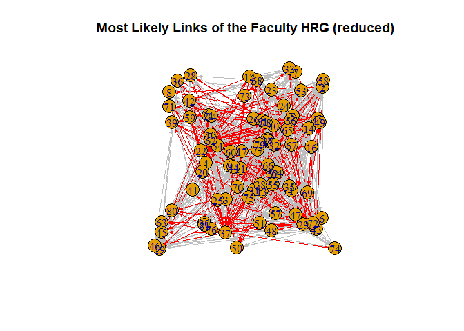
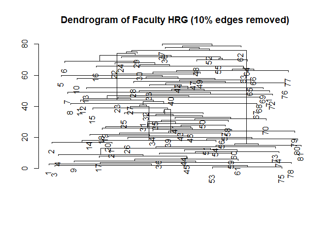

Hierarchical Random Graphs on UK Faculty Data
================
Erin Gregoire,
April 2025

Link prediction using Hierarchical Random Graphs is very helpful when
predicting likely groups within a network. In this mini-project, I will
explore the UK Faculty network and use HRG to make predictions.

Preprocessing & Exploratory Data Analysis:

``` r
optcom <- cluster_optimal(UKfaculty)
```

    ## This graph was created by an old(er) igraph version.
    ## ℹ Call `igraph::upgrade_graph()` on it to use with the current igraph version.
    ## For now we convert it on the fly...

``` r
V(UKfaculty)$comm <- membership(optcom)
plot(optcom, UKfaculty, edge.arrow.size = 0.3, main = "UK Faculty Friendship Network")
```

<!-- -->

This graph shows the Friendship Network of the UK University Faculty.
This graph is directed, as denoted by the arrows in the graph. The
faculty are also clustered into five main groups of friends that do
share some overlap.

Applying the Hierarchical Random Graph methodology to predict new links:

``` r
faculty_hrg <- fit_hrg(UKfaculty)
plot_dendrogram(faculty_hrg)
title("Dendrogram of Faculty HRG")
```

<!-- -->

This graph shows the dendrogram based on the hierarchical random graph
that was fit to the UK faculty friendship network. The graph is quite
dense and difficult to interpret due to the large number of sporadic
observations.

``` r
faculty_preds <- predict_edges(UKfaculty, hrg = faculty_hrg)
plot(faculty_preds$prob, type = "b", main = "Probability of Edge Predictions on the Faculty HRG", ylab = "Probability", xlab = "Edge Index")
```

<!-- -->

This graph shows the large number of edge predictions that were made the
the UK Faculty Friends Network. Based on this network, the hierarchical
random graphs algorithm predicted more than 2,500 edges! Based on this
graph, the elbow happens around 600 edges for the most likely links.
However, since this number is extremely large and may not be the most
accurate depiction, along with making the data difficult to visualize,
let’s take a look at the top 1,000 predictions only.

``` r
E(UKfaculty)$color <- "gray"
lay <- layout_nicely(UKfaculty)
UKfaculty_b <- add_edges(UKfaculty, t(faculty_preds$edges[1:600, ]), color = "red")
plot(UKfaculty_b, edge.arrow.size = 0.3, main = "Most Likely Links of the Faculty HRG")
```

<!-- -->

This graph shows the predicted 600 edges added to the UK Faculty
Friendship Network. Again, due to the high number of predictions, it is
very dense and difficult to interpret all the new edges.

``` r
plot(faculty_preds$prob[1:1000], type = "b", main = "Probability of First 1,000 Edge Predictions", ylab = "Probability", xlab = "Edge Index")
```

<!-- -->

As mentioned above, I am just taking a quick peek at the top 1,000 most
likely predictions to see if there is a better elbow available. One
could argue for approximately 175 or 250. Let’s look at the network with
only 175 predicted edges added.

``` r
UKfaculty_b2 <- add_edges(UKfaculty, t(faculty_preds$edges[1:175, ]), color = "red")
plot(UKfaculty_b2, edge.arrow.size = 0.3, main = "Most Likely Links of the Faculty HRG (reduced)")
```

<!-- -->

After repeating this process again with a reduced number of samples, the
output is much more clearly visible and easier to interpret. However,
there is a loss of prediction due to the scalability since this is such
a large network to begin with.

Using HRG to make predictions to recover “lost” data:

``` r
num_edges <- ecount(UKfaculty)
edges_to_remove <- sample(E(UKfaculty), size = (num_edges*.1))
UKfaculty_c <- delete_edges(UKfaculty, edges_to_remove)
plot(UKfaculty_c, edge.arrow.size = 0.3, main = "Faculty Network with 10% of Edges Removed")
```

<!-- -->

This is a graph of the UK faculty network of friends after 10% of its
edges have been removed. Although there are clusters that are still
quite dense, they appear to be more separated with these edges removed.

``` r
faculty_hrg_c <- fit_hrg(UKfaculty_c)
plot_dendrogram(faculty_hrg_c)
title("Dendrogram of Faculty HRG (10% edges removed)")
```

<!-- -->

This graph shows the dendrogram of the social network now that 10
percent of the edges were removed. The resulting dendrogram is simpler
than the original.

``` r
faculty_preds_c <- predict_edges(UKfaculty_c, hrg = faculty_hrg_c)
plot(faculty_preds_c$prob, type = "b", main = "Probability of Edge Predictions After 10% Removed", ylab = "Probability", xlab = "Edge Index")
```

<!-- -->

After ten percent of the edges were removed, new predictions were made.
Based on this graph, the top 650 predictions show the best probability.
After 650, there is a clear elbow that shows not a lot of predictive
change as it converges to over 2,500.

``` r
UKfaculty_c2 <- add_edges(UKfaculty_c, t(faculty_preds_c$edges[1:650, ]), color = "red")
plot(UKfaculty_c2, edge.arrow.size = 0.3, main = "Most Likely Links of the Faculty HRG")
```

<!-- -->

After 10% of edges were removed, which amounted to 81 edges total, the
algorithm found 650 to be the best number of edges to add back in. This
graph shows the new edges added to the reduced model.

``` r
par(mfrow = c(1, 2))
plot(optcom, UKfaculty, edge.arrow.size = 0.3, main = "Original Faculty Network")
UKfaculty_c2_clustered <- add_edges(UKfaculty_c, t(faculty_preds_c$edges[1:650, ]),attr = list(weight = faculty_preds_c$prob[1:650]))
optcom_c <- cluster_optimal(UKfaculty_c2_clustered)
V(UKfaculty_c2_clustered)$comm <- membership(optcom_c)
plot(optcom_c, UKfaculty_c2_clustered, edge.arrow.size = 0.3, main = "Predictions After 10% of Edges Removed")
```

<!-- -->

This graph shows the comparison of the original model to the reduced and
predicted model, including the resulting clusters. Although both
graphs have the same number of clusters (5), the cluster sizes have
changed between algorithms. For example, after removing the edges and
adding in the predictions, the purple cluster has reduced, but the blue
cluster has grown immensely. Observation 11 seems to be a bit of an
outlier with only two connections in the original network. Although
neither of these original connections were removed, the algorithm
predicted two new edges stemming from 11. Overall, the cluster appears to
have maintained some semblance of the original observations, even with the
new predictions. Due to this, I believe that the algorithm did a pretty
good job.
