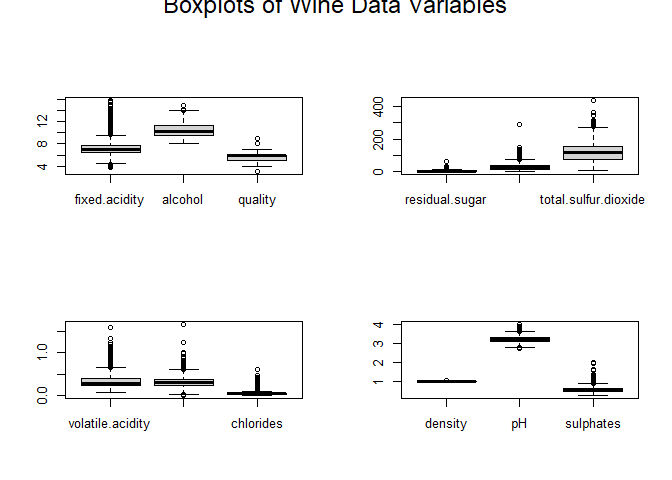
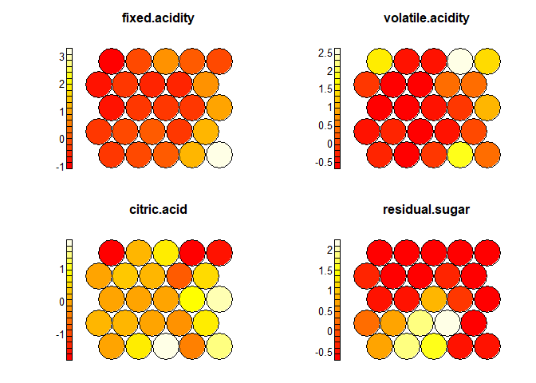

PCA, Kmeans, & SOM on Wine Data
================
Erin Gregoire,
March 2025

Principal components analysis is a powerful tool for dimensionality
reduction and unsupervised learning. Using the principal components of
the data provides a way to gather the most variance while preserving all
variables of the dataset. Using the wine data, I explore different
unsupervised learning techniques on principal components, including
kmeans clustering and self-organizing maps.

Preprocessing & Exploratory Data Analysis:

``` r
setwd("~/GitHub/UnsupervisedWithR")

redwine <- read.csv("winequality-red.csv", header = TRUE, sep = ";")
whitewine <- read.csv("winequality-white.csv", header = TRUE, sep = ";")
wine <- rbind(redwine, whitewine)

redwine$color <- "red"
whitewine$color <- "white"
wine_labelled <- rbind(redwine, whitewine)

library(cluster)
library(factoextra)
```

    ## Warning: package 'factoextra' was built under R version 4.5.1

    ## Loading required package: ggplot2

    ## Welcome! Want to learn more? See two factoextra-related books at https://goo.gl/ve3WBa

``` r
library(kohonen)
```

    ## Warning: package 'kohonen' was built under R version 4.5.1

``` r
set.seed(777)
```

``` r
str(wine)
```

    ## 'data.frame':    6497 obs. of  12 variables:
    ##  $ fixed.acidity       : num  7.4 7.8 7.8 11.2 7.4 7.4 7.9 7.3 7.8 7.5 ...
    ##  $ volatile.acidity    : num  0.7 0.88 0.76 0.28 0.7 0.66 0.6 0.65 0.58 0.5 ...
    ##  $ citric.acid         : num  0 0 0.04 0.56 0 0 0.06 0 0.02 0.36 ...
    ##  $ residual.sugar      : num  1.9 2.6 2.3 1.9 1.9 1.8 1.6 1.2 2 6.1 ...
    ##  $ chlorides           : num  0.076 0.098 0.092 0.075 0.076 0.075 0.069 0.065 0.073 0.071 ...
    ##  $ free.sulfur.dioxide : num  11 25 15 17 11 13 15 15 9 17 ...
    ##  $ total.sulfur.dioxide: num  34 67 54 60 34 40 59 21 18 102 ...
    ##  $ density             : num  0.998 0.997 0.997 0.998 0.998 ...
    ##  $ pH                  : num  3.51 3.2 3.26 3.16 3.51 3.51 3.3 3.39 3.36 3.35 ...
    ##  $ sulphates           : num  0.56 0.68 0.65 0.58 0.56 0.56 0.46 0.47 0.57 0.8 ...
    ##  $ alcohol             : num  9.4 9.8 9.8 9.8 9.4 9.4 9.4 10 9.5 10.5 ...
    ##  $ quality             : int  5 5 5 6 5 5 5 7 7 5 ...

``` r
pairs(wine, main = "Pairs Plot of Wine Data")
```

<!-- -->

This pairs plot shows the associations between each of the variables in
the wine dataset. There does not seem to be any clear or extreme
correlations. But it is possible that some outliers are present in the
dataset.

``` r
which(is.na(wine) == TRUE)
```

    ## integer(0)

``` r
summary(wine)
```

    ##  fixed.acidity    volatile.acidity  citric.acid     residual.sugar  
    ##  Min.   : 3.800   Min.   :0.0800   Min.   :0.0000   Min.   : 0.600  
    ##  1st Qu.: 6.400   1st Qu.:0.2300   1st Qu.:0.2500   1st Qu.: 1.800  
    ##  Median : 7.000   Median :0.2900   Median :0.3100   Median : 3.000  
    ##  Mean   : 7.215   Mean   :0.3397   Mean   :0.3186   Mean   : 5.443  
    ##  3rd Qu.: 7.700   3rd Qu.:0.4000   3rd Qu.:0.3900   3rd Qu.: 8.100  
    ##  Max.   :15.900   Max.   :1.5800   Max.   :1.6600   Max.   :65.800  
    ##    chlorides       free.sulfur.dioxide total.sulfur.dioxide    density      
    ##  Min.   :0.00900   Min.   :  1.00      Min.   :  6.0        Min.   :0.9871  
    ##  1st Qu.:0.03800   1st Qu.: 17.00      1st Qu.: 77.0        1st Qu.:0.9923  
    ##  Median :0.04700   Median : 29.00      Median :118.0        Median :0.9949  
    ##  Mean   :0.05603   Mean   : 30.53      Mean   :115.7        Mean   :0.9947  
    ##  3rd Qu.:0.06500   3rd Qu.: 41.00      3rd Qu.:156.0        3rd Qu.:0.9970  
    ##  Max.   :0.61100   Max.   :289.00      Max.   :440.0        Max.   :1.0390  
    ##        pH          sulphates         alcohol         quality     
    ##  Min.   :2.720   Min.   :0.2200   Min.   : 8.00   Min.   :3.000  
    ##  1st Qu.:3.110   1st Qu.:0.4300   1st Qu.: 9.50   1st Qu.:5.000  
    ##  Median :3.210   Median :0.5100   Median :10.30   Median :6.000  
    ##  Mean   :3.219   Mean   :0.5313   Mean   :10.49   Mean   :5.818  
    ##  3rd Qu.:3.320   3rd Qu.:0.6000   3rd Qu.:11.30   3rd Qu.:6.000  
    ##  Max.   :4.010   Max.   :2.0000   Max.   :14.90   Max.   :9.000

``` r
par(mfrow = c(2, 2))
par(oma = c(0, 0, 2, 0))
boxplot(wine[ , c(1, 11, 12)])
boxplot(wine[ , c(4, 6, 7)])
boxplot(wine[ , c(2, 3, 5)])
boxplot(wine[ , c(8, 9, 10)])
mtext("Boxplots of Wine Data Variables", side = 3, outer = TRUE, line = 1, cex = 1.5)
```

<!-- -->

These boxplots show the distribution of ranges of each variable in the
wine dataset. There appears to be a pretty large number of outliers,
with every variable having a couple. Let’s take a look at some of the
outliers more closely.

``` r
# identify outliers
which(wine_labelled$free.sulfur.dioxide > 250) 
```

    ## [1] 6345

``` r
wine_labelled[6345,]
```

    ##      fixed.acidity volatile.acidity citric.acid residual.sugar chlorides
    ## 6345           6.1             0.26        0.25            2.9     0.047
    ##      free.sulfur.dioxide total.sulfur.dioxide density   pH sulphates alcohol
    ## 6345                 289                  440 0.99314 3.44      0.64    10.5
    ##      quality color
    ## 6345       3 white

``` r
which(wine_labelled$sulphates > 1.9) 
```

    ## [1]  87  92  93 152

``` r
wine_labelled[c(87, 92, 93, 152),]
```

    ##     fixed.acidity volatile.acidity citric.acid residual.sugar chlorides
    ## 87            8.6             0.49        0.28            1.9      0.11
    ## 92            8.6             0.49        0.28            1.9      0.11
    ## 93            8.6             0.49        0.29            2.0      0.11
    ## 152           9.2             0.52        1.00            3.4      0.61
    ##     free.sulfur.dioxide total.sulfur.dioxide density   pH sulphates alcohol
    ## 87                   20                  136  0.9972 2.93      1.95     9.9
    ## 92                   20                  136  0.9972 2.93      1.95     9.9
    ## 93                   19                  133  0.9972 2.93      1.98     9.8
    ## 152                  32                   69  0.9996 2.74      2.00     9.4
    ##     quality color
    ## 87        6   red
    ## 92        6   red
    ## 93        5   red
    ## 152       4   red

``` r
which(wine_labelled$volatile.acidity > 1.5) 
```

    ## [1] 1300

``` r
wine_labelled[1300,]
```

    ##      fixed.acidity volatile.acidity citric.acid residual.sugar chlorides
    ## 1300           7.6             1.58           0            2.1     0.137
    ##      free.sulfur.dioxide total.sulfur.dioxide density  pH sulphates alcohol
    ## 1300                   5                    9 0.99476 3.5       0.4    10.9
    ##      quality color
    ## 1300       3   red

``` r
which(wine_labelled$chlorides > .6) 
```

    ## [1] 152 259

``` r
wine_labelled[c(152, 259),]
```

    ##     fixed.acidity volatile.acidity citric.acid residual.sugar chlorides
    ## 152           9.2             0.52        1.00            3.4     0.610
    ## 259           7.7             0.41        0.76            1.8     0.611
    ##     free.sulfur.dioxide total.sulfur.dioxide density   pH sulphates alcohol
    ## 152                  32                   69  0.9996 2.74      2.00     9.4
    ## 259                   8                   45  0.9968 3.06      1.26     9.4
    ##     quality color
    ## 152       4   red
    ## 259       5   red

Overall, the quality of the data is high. There are no missing data
points. The structure is consistent, as noted by all variables being in the
correct data type and uniform, since almost all of the data types are
numerical. This is also seen when combining the red and white wine data,
all variables aligned and merged without difficulty or inconsistencies.
Having a high number of observations is also an advantage of this
dataset. However, one downside is that there are more than double the
number of white wine samples than there are red wine samples. This may
lead to unintended bias towards white wine that we should be aware of
going forward. With regards to outliers, all of the outliers that are
high in sulphates are red wines. The same holds true for fixed acidity
and chlorides as well. This may mean that the red wine has more
versatility across the variables than the white wine does.

Implementing PCA & Kmeans on the principal components:

``` r
plot(gap_kmeans, main = "Gap Statistic: kmeans")
```

<!-- -->

This graph shows the gap statistic on the wine data when using the
k-means algorithm. Based on this graph, I believe that the best choice
for k is 5. Although three may also be a good choice, it seems like five
is the best option since convergence occurs soon after.

``` r
best_wine_km <- kmeans(wine_pc$x, centers = 5, nstart = 10)

fviz_pca_biplot(wine_pc, label = "var", habillage = wine_labelled$color, col.var = "black", title = "Biplot of Wine Principal Components")
```

<!-- -->

This biplot shows the loading vectors over the observations of red and
wine data. Some clear observations can be made from this graph. The red
and white wines have a clear separation with different variables that
heavily correlate with them. White wine can be identified by its
levels of citric acid, residual sugar, and sulfur dioxide. Other
variables do not play as much of a role in defining white wine. Red wine
is driven by the variables of chloride, sulfates, and acidity/pH. The
other variable loadings do not provide as much information about red
wine.

``` r
wine_labelled$color <- as.factor(wine_labelled$color)
colors = c("red", "purple", "blue", "green", "orange")
shapes = c(1, 2)
plot(wine_pc$x[ , c(1:2)], col = colors[best_wine_km$cluster], pch = shapes[as.numeric(wine_labelled$color)], main = "k-means with wine data in PC space")
legend("bottomright", legend = levels(wine_labelled$color), pch = shapes)
legend("topright", legend = levels(as.factor(best_wine_km$cluster)), col = colors, pch = shapes)
```

<!-- -->

This graph shows the results of the k-means algorithm on the first two
principal components. Since the optimal k value was determined to be
five, there are five clusters shown in the graph. Although it is a bit
challenging to see in the graph due to the amount of overlapping and
density of the clusters, three clusters fall mainly into white wine, and
two fall into red wine. Each of the five clusters creates its own
region, and although there is some overlapping between the regions, it is
mostly distinctive, with the clusters just being very close to each
other. The white wine is clustered pretty evenly across the red, blue,
and green clusters, and the red wine is divided by the orange and purple
clusters. Since these clusters create such distinct pockets, we can
infer that there are multiple types of each color of wine. For example,
red wine may have a cluster for sweet and a cluster for dry.

Fitting a Self-Organizing Map:

``` r
wine_scaled <- scale(wine) # also used scaling with principal components and kmeans but was taken care of directly in the pca function.
som_grid <- somgrid(xdim = 5, ydim = 5, topo = "hexagonal")
wine_som <- som(wine_scaled, grid = som_grid, rlen = 100)

plot(wine_som, type = "mapping", main = "Wine Data Self-Organizing Map", col = wine_labelled$color)
legend("bottomright", legend = levels(wine_labelled$color), col = unique(wine_labelled$color), pch = 1)
```

<!-- -->

This graph shows the self-organizing map for the wine data. The map
predominantly shows samples with white wine, which makes sense since
there are many more observations with white wine than red wine. In every
unit that is predominantly filled with red wine observations, there
always appears to be some white wine observations that sneak in also,
except for two fully red wine units that have a smaller number of
observations inside. Similarly, there are many units of mostly white
wine that have a couple of red wine samples trickle over, but it is not
as common.

``` r
wine_codebooks <- data.frame(wine_som$codes)
d <- dist(wine_codebooks)
wine_hc <- hclust(d, method = "ave")

plot(wine_hc, main = "Wine Codebook Dendogram")
abline(h=3.5, col = "red")
```

<!-- -->

This graph shows the dendrogram created by hierarchical clustering on the
wine codebooks. Based on this, a good choice to cut the dendrogram would
be at a height of three and a half. A line was drawn at this height to
demonstrate and help determine the best line to cut to create the
clusters.

``` r
wine_som_cluster <- cutree(wine_hc, h = 3.5)
wine_som_cluster
```

    ##  V1  V2  V3  V4  V5  V6  V7  V8  V9 V10 V11 V12 V13 V14 V15 V16 V17 V18 V19 V20 
    ##   1   1   1   2   3   1   4   1   1   3   4   4   4   5   6   4   4   4   4   2 
    ## V21 V22 V23 V24 V25 
    ##   7   4   4   2   2

``` r
my_colors <- c("red", "blue", "purple", "magenta", "orange", "green", "cyan")
my_bgcol <- my_colors[wine_som_cluster]
wine_colors <- c("white", "black")

plot(wine_som, type = "mapping", col = wine_colors[wine_labelled$color], bgcol = my_bgcol, main = "Clustered Wine Self-Organizing Maps")
add.cluster.boundaries(wine_som, wine_som_cluster)
```

<!-- -->

After cutting the dendrogram at a height of 3.5, six hierarchical
clusters were created. This graph shows how the self-organizing map of
the wine data was clustered. The black circles represent the white wine
observations, and the white circles represent red wine samples. The
bigger, brightly-colored units represent the clusters that were created.
There are three big clusters that emerge and four significantly smaller
clusters. The pink, purple, and red clusters both represent units that
are made of mostly white wine observations. The blue, green, and orange
clusters represent most red wine samples. This representation gives a
clear visualization that red and white wines have distinct
characteristics and, for the most part, can be easily classified into
their own clusters. There are only a few stragglers that end up 
with the opposite wine color.

``` r
par(mfrow = c(2,2))
for(i in 1:12){
  plot(wine_som, type = "property", property = wine_codebooks[ , i], main  = colnames(wine_codebooks)[i])
}
```

<!-- --><!-- --><!-- -->

These phase plots show how the different variables affect and are
distributed across the wine data’s self-organizing maps. Both fixed and
volatile acidity show high concentrations of dark red to the left of the
map and lighter orange and yellow to the right of the map. Since we know
that the red wines are mostly located to the right of the map, this
means that red wine has higher concentrations of acidity than white
wine. Citric acid shows that white wine lies in the middle of the
concentration scale, but red wine falls on both sides of the extreme.
Residual sugar appears to be low for most wines, regardless of color,
except for a small grouping that lives in the upper left units. For the
most part, the wines in the dataset are low in chlorides and sulphates
with the exception of a couple of outliers in the upper right area. Sulfur
dioxide levels appear to be associated more highly with white wines. The
density of the wine observations appears to be split roughly in half
having a high density and half having a low density. However, these
occur relatively regardless of wine color. A similar pattern to the
density variable also occurs with the pH and alcohol variables. Lastly,
quality appears to be in the mid-range for the majority of the samples,
with some of the white wines reaching the highest quality.

Evaluation & Comparative Analysis:

Working on the principal components of the wine data set, the k-means
algorithm found the best number of clusters to be five. Meanwhile,
working on the self-organizing map, the hierarchical clustering found
the best number of clusters to be six. Looking at the graphs of both
clusterings, they both found that the clusters have pretty distinct
groupings, although they are very close together and overlap at times.
The hierarchical clusterings produced one large cluster with the
remaining being small pocket clusters, while the kmeans algorithm had
more evenly sized clusters. The clusters in the kmeans on the principal
components are much more uniform in size and shape. The clusters of both
methods tend to contain a majority of either red or white wines, and no
clusters contain an evenly balanced mix of the two wine colors.
