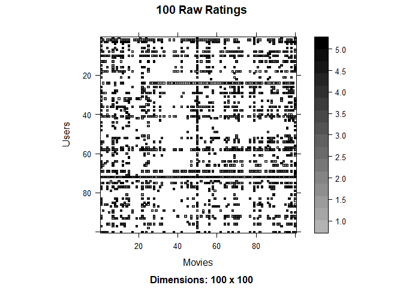
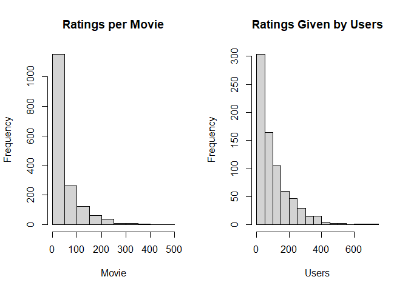

Recommender Systems on Movie Reviews
================
Erin Gregoire,
March 2025

Using the MovieLense data in this mini-project, I evaluate the top-rated
movies based on a user-based recommender system. These results are then
used to predict new movies that the user may enjoy.

Preprocessing & Exploratory Data Analysis:

``` r
library(recommenderlab)
```

    ## Warning: package 'recommenderlab' was built under R version 4.5.1

    ## Loading required package: Matrix

    ## Loading required package: arules

    ## Warning: package 'arules' was built under R version 4.5.1

    ## 
    ## Attaching package: 'arules'

    ## The following objects are masked from 'package:base':
    ## 
    ##     abbreviate, write

    ## Loading required package: proxy

    ## Warning: package 'proxy' was built under R version 4.5.1

    ## 
    ## Attaching package: 'proxy'

    ## The following object is masked from 'package:Matrix':
    ## 
    ##     as.matrix

    ## The following objects are masked from 'package:stats':
    ## 
    ##     as.dist, dist

    ## The following object is masked from 'package:base':
    ## 
    ##     as.matrix

    ## Registered S3 methods overwritten by 'registry':
    ##   method               from 
    ##   print.registry_field proxy
    ##   print.registry_entry proxy

``` r
data(MovieLense)
?MovieLense
```

    ## starting httpd help server ...

    ##  done

``` r
dim(MovieLense) #943 users, 1664 movies
```

    ## [1]  943 1664

``` r
class(MovieLense)
```

    ## [1] "realRatingMatrix"
    ## attr(,"package")
    ## [1] "recommenderlab"

``` r
set.seed(50369)
movies <- sample(MovieLense, 750, replace = FALSE)
dim(movies) #750 users, 1664 movies
```

    ## [1]  750 1664

``` r
getRatingMatrix(movies)[1:10, 1:10]
```

    ## 10 x 10 sparse Matrix of class "dgCMatrix"

    ##   [[ suppressing 10 column names 'Toy Story (1995)', 'GoldenEye (1995)', 'Four Rooms (1995)' ... ]]

    ##                        
    ## 294 5 . . . . . 4 . . 3
    ## 655 2 3 . 2 2 4 3 3 3 .
    ## 592 4 . 4 4 . . 5 5 5 .
    ## 480 . . . . . . . 5 . .
    ## 879 4 . . . . . . . . .
    ## 875 . . . 3 . . . 3 . .
    ## 441 5 . . . . . 4 . 4 .
    ## 727 3 4 . . 3 . 2 . . .
    ## 212 . . . . . . . . . .
    ## 435 5 4 3 4 2 . 4 3 4 5

Since not every user has seen and/or rated every movie, this matrix has
a lot of blanks/NAs.

``` r
image(movies[1:100, 1:100], main = "100 Raw Ratings", ylab = "Users", xlab = "Movies")
```

<!-- -->

This plot shows the first 100 raw ratings of the MovieLense sample. It
is quite difficult to get a good grasp on the trends due to the gray
scale and sparse nature of this graph.

``` r
par(mfrow = c(1, 2))
hist(colCounts(movies), main = "Ratings per Movie", xlab = "Movie")
hist(rowCounts(movies), main = "Ratings Given by Users", xlab = "Users")
```

<!-- -->

These two distributions show that a small number of movies have been
rated many times by the users, and similarly, a small number of users
have given the highest number of ratings, leading to these skewed graphs.

Implementing a User-based Recommender System:

``` r
eval <- evaluationScheme(movies, method = "split", given = 15, train=0.5, goodRating=4)
eval
```

    ## Evaluation scheme with 15 items given
    ## Method: 'split' with 1 run(s).
    ## Training set proportion: 0.500
    ## Good ratings: >=4.000000
    ## Data set: 750 x 1664 rating matrix of class 'realRatingMatrix' with 79116 ratings.

``` r
user_based <- Recommender(getData(eval, "train"), "UBCF")

sample_users <- sample(movies, 5)
user_based_preds <- predict(user_based, sample_users, n=10)
user_based_preds
```

    ## Recommendations as 'topNList' with n = 10 for 5 users.

``` r
as(user_based_preds, "list")
```

    ## $`0`
    ##  [1] "Raise the Red Lantern (1991)"  "First Wives Club, The (1996)" 
    ##  [3] "Deconstructing Harry (1997)"   "Sweet Hereafter, The (1997)"  
    ##  [5] "Four Days in September (1997)" "Amistad (1997)"               
    ##  [7] "Congo (1995)"                  "Titanic (1997)"               
    ##  [9] "Dances with Wolves (1990)"     "Assignment, The (1997)"       
    ## 
    ## $`1`
    ##  [1] "Wild Bunch, The (1969)"                                                         
    ##  [2] "Bogus (1996)"                                                                   
    ##  [3] "Bulletproof (1996)"                                                             
    ##  [4] "Don't Be a Menace to South Central While Drinking Your Juice in the Hood (1996)"
    ##  [5] "Wizard of Oz, The (1939)"                                                       
    ##  [6] "Gone with the Wind (1939)"                                                      
    ##  [7] "Third Man, The (1949)"                                                          
    ##  [8] "Rebecca (1940)"                                                                 
    ##  [9] "Deconstructing Harry (1997)"                                                    
    ## [10] "Sweet Hereafter, The (1997)"                                                    
    ## 
    ## $`2`
    ##  [1] "Tango Lesson, The (1997)"              
    ##  [2] "Secrets & Lies (1996)"                 
    ##  [3] "Donnie Brasco (1997)"                  
    ##  [4] "Crucible, The (1996)"                  
    ##  [5] "Brassed Off (1996)"                    
    ##  [6] "Anne Frank Remembered (1995)"          
    ##  [7] "Blade Runner (1982)"                   
    ##  [8] "She's the One (1996)"                  
    ##  [9] "Reservoir Dogs (1992)"                 
    ## [10] "Good, The Bad and The Ugly, The (1966)"
    ## 
    ## $`3`
    ##  [1] "French Kiss (1995)"                                  
    ##  [2] "Apostle, The (1997)"                                 
    ##  [3] "Tango Lesson, The (1997)"                            
    ##  [4] "Hunchback of Notre Dame, The (1996)"                 
    ##  [5] "Kolya (1996)"                                        
    ##  [6] "Celluloid Closet, The (1995)"                        
    ##  [7] "Shanghai Triad (Yao a yao yao dao waipo qiao) (1995)"
    ##  [8] "Antonia's Line (1995)"                               
    ##  [9] "Citizen Ruth (1996)"                                 
    ## [10] "Young Poisoner's Handbook, The (1995)"               
    ## 
    ## $`4`
    ##  [1] "Jungle Book, The (1994)"           "Wings of Desire (1987)"           
    ##  [3] "Man Who Would Be King, The (1975)" "Innocents, The (1961)"            
    ##  [5] "Delta of Venus (1994)"             "Good Will Hunting (1997)"         
    ##  [7] "Ace Ventura: Pet Detective (1994)" "My Best Friend's Wedding (1997)"  
    ##  [9] "Deer Hunter, The (1978)"           "Philadelphia Story, The (1940)"

``` r
ub_test_preds <- predict(user_based, getData(eval, "known"), type="ratings")
ub_error <- rbind(UBCF = calcPredictionAccuracy(ub_test_preds, getData(eval,"unknown")))
ub_error
```

    ##         RMSE      MSE       MAE
    ## UBCF 1.19646 1.431516 0.9370944

Based on the performance metrics given by the error functions, the
user-based recommender system does a pretty good job at recommending
movies. The MSE, RMSE, and MAE are quite low. We do wish that they would
be as close to zero as possible, but since these values are still very
low, this indicates a decent model.

Implementing an Item-based Recommender System:

``` r
item_based <- Recommender(getData(eval, "train"), "IBCF")
item_based_preds <- predict(item_based, sample_users, n=10)
item_based_preds
```

    ## Recommendations as 'topNList' with n = 10 for 5 users.

``` r
as(item_based_preds, "list")
```

    ## $`0`
    ##  [1] "For Richer or Poorer (1997)"                      
    ##  [2] "Dangerous Beauty (1998)"                          
    ##  [3] "They Made Me a Criminal (1939)"                   
    ##  [4] "Kicked in the Head (1997)"                        
    ##  [5] "Ballad of Narayama, The (Narayama Bushiko) (1958)"
    ##  [6] "For the Moment (1994)"                            
    ##  [7] "Hurricane Streets (1998)"                         
    ##  [8] "Stars Fell on Henrietta, The (1995)"              
    ##  [9] "War Room, The (1993)"                             
    ## [10] "Nenette et Boni (1996)"                           
    ## 
    ## $`1`
    ##  [1] "White Balloon, The (1995)"                                 
    ##  [2] "Nadja (1994)"                                              
    ##  [3] "Priest (1994)"                                             
    ##  [4] "Horseman on the Roof, The (Hussard sur le toit, Le) (1995)"
    ##  [5] "When the Cats Away (Chacun cherche son chat) (1996)"       
    ##  [6] "3 Ninjas: High Noon At Mega Mountain (1998)"               
    ##  [7] "Critical Care (1997)"                                      
    ##  [8] "Client, The (1994)"                                        
    ##  [9] "Assignment, The (1997)"                                    
    ## [10] "Kid in King Arthur's Court, A (1995)"                      
    ## 
    ## $`2`
    ##  [1] "Assignment, The (1997)"            "Ponette (1996)"                   
    ##  [3] "Mrs. Dalloway (1997)"              "Lay of the Land, The (1997)"      
    ##  [5] "Boys of St. Vincent, The (1993)"   "Kicked in the Head (1997)"        
    ##  [7] "Convent, The (Convento, O) (1995)" "For the Moment (1994)"            
    ##  [9] "Hollow Reed (1996)"                "Losing Chase (1996)"              
    ## 
    ## $`3`
    ##  [1] "Mrs. Dalloway (1997)"                                     
    ##  [2] "Hollow Reed (1996)"                                       
    ##  [3] "Cosi (1996)"                                              
    ##  [4] "Temptress Moon (Feng Yue) (1996)"                         
    ##  [5] "Before the Rain (Pred dozhdot) (1994)"                    
    ##  [6] "Boys of St. Vincent, The (1993)"                          
    ##  [7] "I Don't Want to Talk About It (De eso no se habla) (1993)"
    ##  [8] "Exotica (1994)"                                           
    ##  [9] "Three Colors: Red (1994)"                                 
    ## [10] "Three Colors: White (1994)"                               
    ## 
    ## $`4`
    ##  [1] "Hollow Reed (1996)"               "Temptress Moon (Feng Yue) (1996)"
    ##  [3] "Frankie Starlight (1995)"         "Night Flier (1997)"              
    ##  [5] "Across the Sea of Time (1995)"    "Rent-a-Kid (1995)"               
    ##  [7] "Celestial Clockwork (1994)"       "Tom & Viv (1994)"                
    ##  [9] "Zeus and Roxanne (1997)"          "Awfully Big Adventure, An (1995)"

``` r
ib_test_preds <- predict(item_based, getData(eval, "known"), type="ratings")
ib_error <- rbind(IBCF = calcPredictionAccuracy(ib_test_preds, getData(eval,"unknown")))
ib_error
```

    ##          RMSE      MSE      MAE
    ## IBCF 1.401578 1.964421 1.007697

After creating an item-based recommender system with the same criteria,
we can see that it performs pretty similarly in terms of error as the
user-based system did. Overall, the user-based recommender system had
slightly better error rates, as seen by lower MSE, RMSE, and MAE. However,
since the error measurements are in the same range, I do think that the
item-based recommender system likely also performed relatively well.

Comparative Analysis:

``` r
table(user_based_preds@items$`0`, item_based_preds@items$`0`)
```

    ##       
    ##        885 901 1113 1132 1224 1285 1337 1347 1385 1454
    ##   97     0   0    0    1    0    0    0    0    0    0
    ##   311    0   0    0    0    0    0    0    0    0    1
    ##   343    0   0    1    0    0    0    0    0    0    0
    ##   356    0   0    0    0    1    0    0    0    0    0
    ##   473    0   1    0    0    0    0    0    0    0    0
    ##   744    0   0    0    0    0    0    0    1    0    0
    ##   763    0   0    0    0    0    0    0    0    1    0
    ##   888    0   0    0    0    0    1    0    0    0    0
    ##   915    1   0    0    0    0    0    0    0    0    0
    ##   1053   0   0    0    0    0    0    1    0    0    0

``` r
table(user_based_preds@items$`1`, item_based_preds@items$`1`)
```

    ##       
    ##        18 37 57 113 256 312 339 353 356 556
    ##   132   0  0  0   0   1   0   0   0   0   0
    ##   133   0  0  0   0   0   1   0   0   0   0
    ##   343   0  0  0   0   0   0   0   0   1   0
    ##   509   0  0  0   0   0   0   1   0   0   0
    ##   585   1  0  0   0   0   0   0   0   0   0
    ##   603   0  0  0   0   0   0   0   1   0   0
    ##   826   0  1  0   0   0   0   0   0   0   0
    ##   827   0  0  1   0   0   0   0   0   0   0
    ##   888   0  0  0   0   0   0   0   0   0   1
    ##   1050  0  0  0   1   0   0   0   0   0   0

``` r
table(user_based_preds@items$`2`, item_based_preds@items$`2`)
```

    ##       
    ##        356 532 1015 1017 1183 1285 1332 1347 1370 1371
    ##   89     0   0    0    0    0    0    1    0    0    0
    ##   156    0   0    0    0    0    0    0    0    1    0
    ##   177    0   0    0    0    0    0    0    0    0    1
    ##   284    0   1    0    0    0    0    0    0    0    0
    ##   292    0   0    1    0    0    0    0    0    0    0
    ##   671    0   0    0    1    0    0    0    0    0    0
    ##   881    1   0    0    0    0    0    0    0    0    0
    ##   928    0   0    0    0    1    0    0    0    0    0
    ##   1039   0   0    0    0    0    0    0    1    0    0
    ##   1075   0   0    0    0    0    1    0    0    0    0

``` r
table(user_based_preds@items$`3`, item_based_preds@items$`3`)
```

    ##      
    ##       46 59 61 1015 1183 1184 1370 1523 1527 1637
    ##   6    0  0  0    0    0    0    0    1    0    0
    ##   19   1  0  0    0    0    0    0    0    0    0
    ##   236  0  1  0    0    0    0    0    0    0    0
    ##   242  0  0  0    0    0    1    0    0    0    0
    ##   342  0  0  0    0    0    0    1    0    0    0
    ##   543  0  0  1    0    0    0    0    0    0    0
    ##   592  0  0  0    0    0    0    0    0    0    1
    ##   775  0  0  0    1    0    0    0    0    0    0
    ##   807  0  0  0    0    1    0    0    0    0    0
    ##   881  0  0  0    0    0    0    0    0    1    0

``` r
table(user_based_preds@items$`4`, item_based_preds@items$`4`)
```

    ##       
    ##        751 1034 1071 1139 1155 1218 1234 1370 1535 1637
    ##   67     0    0    1    0    0    0    0    0    0    0
    ##   255    0    0    0    1    0    0    0    0    0    0
    ##   271    0    1    0    0    0    0    0    0    0    0
    ##   462    0    0    0    0    0    0    0    1    0    0
    ##   475    0    0    0    0    0    1    0    0    0    0
    ##   508    0    0    0    0    0    0    0    0    0    1
    ##   517    0    0    0    0    1    0    0    0    0    0
    ##   526    0    0    0    0    0    0    0    0    1    0
    ##   1116   0    0    0    0    0    0    1    0    0    0
    ##   1296   1    0    0    0    0    0    0    0    0    0

These tables show the movies recommended by the user-based recommender
system on the rows and the item-based recommender system on the columns.
All of these tables show that the movies recommended for each user were
completely different, depending on the model.

``` r
Model = c('UBCF', 'IBCF')
RMSE = c(round(ub_error[1], 4), round(ib_error[1], 4))
MSE = c(round(ub_error[2], 4), round(ib_error[2], 4))
MAE = c(round(ub_error[3], 4), round(ib_error[3], 4))
Error_Rate_Table <- data.frame(Model, RMSE, MSE, MAE)
Error_Rate_Table
```

    ##   Model   RMSE    MSE    MAE
    ## 1  UBCF 1.1965 1.4315 0.9371
    ## 2  IBCF 1.4016 1.9644 1.0077

Based on this error table, the models performed similarly with regard
to their error results. However, the user-based recommender system overall
has better results in terms of error. This may be the reason for the big
differences in recommendations for the users. It is possible that the
user-based recommender chose movies to recommend that were better suited
for the users than the item-based model.

Evaluation of User-Based Recommender System:

Relevance:

``` r
relevance_results <- evaluate(eval, method = "UBCF", type="topNList", n=10)
```

    ## UBCF run fold/sample [model time/prediction time]
    ##   1  [0sec/1.32sec]

``` r
relevance_results
```

    ## Evaluation results for 1 folds/samples using method 'UBCF'.

``` r
precision <- getConfusionMatrix(relevance_results)[[1]][6]
precision
```

    ## [1] 0.08181818

``` r
recall <- getConfusionMatrix(relevance_results)[[1]][7]
recall
```

    ## [1] 0.0123467

Relevance tells us whether the items that have been recommended to users
are applicable or compatible for them. The values of precision and
recall help to determine the recommender system’s relevance. The values
for recall and precision that were received from this system’s
evaluation scheme are extremely low. Typically, we would want to see
values over 80% to say that a system has great relevance. Unfortunately,
that is not the case here, and this model did quite poorly at providing
recommendations in terms of relevance. This is also confusing after we
just noted that the error rates for the user-based recommender system
appeared as though they did a good job at providing recommended movies
for the users.

Novelty:

``` r
recoms_for_user0 <- user_based_preds@items$'0' # movies that were recommended for user 0
user0 <- sample_users[which(rownames(sample_users) == "108"), recoms_for_user0]
user0
```

    ## 1 x 10 rating matrix of class 'realRatingMatrix' with 0 ratings.

``` r
recoms_for_user1 <- user_based_preds@items$'1' # movies that were recommended for user 1
user1 <- sample_users[which(rownames(sample_users) == "771"), recoms_for_user1] 
user1
```

    ## 1 x 10 rating matrix of class 'realRatingMatrix' with 0 ratings.

``` r
recoms_for_user2 <- user_based_preds@items$'2' # movies that were recommended for user 2
user2 <- sample_users[which(rownames(sample_users) == "210"), recoms_for_user2]
user2
```

    ## 1 x 10 rating matrix of class 'realRatingMatrix' with 0 ratings.

``` r
recoms_for_user3 <- user_based_preds@items$'3' # movies that were recommended for user 3
user3 <- sample_users[which(rownames(sample_users) == "774"), recoms_for_user3]
user3
```

    ## 1 x 10 rating matrix of class 'realRatingMatrix' with 0 ratings.

``` r
recoms_for_user4 <- user_based_preds@items$'4' # movies that were recommended for user 4
user4 <- sample_users[which(rownames(sample_users) == "706"), recoms_for_user4]
user4
```

    ## 1 x 10 rating matrix of class 'realRatingMatrix' with 0 ratings.

Novelty is a goal that helps us ensure that we are presenting new
options for users. To evaluate the recommender system’s novelty, I
verified if any of the movies that the model recommended for the user
had been previously rated by the user. For all five of the users, none
of the movies that had been recommended to them by the model had been
rated by them before. Based on this factor alone, I believe that this
user-based recommender system’s novelty is high.

Diversity:

``` r
genres_for_user0 <- MovieLenseMeta[recoms_for_user0, ]
colSums(genres_for_user0[4:22])
```

    ##     unknown      Action   Adventure   Animation  Children's      Comedy 
    ##           0           2           2           0           0           2 
    ##       Crime Documentary       Drama     Fantasy   Film-Noir      Horror 
    ##           0           0           7           0           0           0 
    ##     Musical     Mystery     Romance      Sci-Fi    Thriller         War 
    ##           0           1           1           1           1           0 
    ##     Western 
    ##           1

``` r
genres_for_user1 <- MovieLenseMeta[recoms_for_user1, ]
colSums(genres_for_user1[4:22])
```

    ##     unknown      Action   Adventure   Animation  Children's      Comedy 
    ##           0           1           1           0           2           2 
    ##       Crime Documentary       Drama     Fantasy   Film-Noir      Horror 
    ##           0           0           5           1           0           0 
    ##     Musical     Mystery     Romance      Sci-Fi    Thriller         War 
    ##           1           1           2           0           2           1 
    ##     Western 
    ##           1

``` r
genres_for_user2 <- MovieLenseMeta[recoms_for_user2, ]
colSums(genres_for_user2[4:22])
```

    ##     unknown      Action   Adventure   Animation  Children's      Comedy 
    ##           0           1           0           0           0           2 
    ##       Crime Documentary       Drama     Fantasy   Film-Noir      Horror 
    ##           2           1           4           0           1           0 
    ##     Musical     Mystery     Romance      Sci-Fi    Thriller         War 
    ##           0           0           3           1           1           0 
    ##     Western 
    ##           1

``` r
genres_for_user3 <- MovieLenseMeta[recoms_for_user3, ]
colSums(genres_for_user3[4:22])
```

    ##     unknown      Action   Adventure   Animation  Children's      Comedy 
    ##           0           0           0           1           1           3 
    ##       Crime Documentary       Drama     Fantasy   Film-Noir      Horror 
    ##           1           1           4           0           0           0 
    ##     Musical     Mystery     Romance      Sci-Fi    Thriller         War 
    ##           1           0           2           0           0           0 
    ##     Western 
    ##           0

``` r
genres_for_user4 <- MovieLenseMeta[recoms_for_user4, ]
colSums(genres_for_user4[4:22])
```

    ##     unknown      Action   Adventure   Animation  Children's      Comedy 
    ##           0           0           2           0           1           4 
    ##       Crime Documentary       Drama     Fantasy   Film-Noir      Horror 
    ##           0           0           4           0           0           0 
    ##     Musical     Mystery     Romance      Sci-Fi    Thriller         War 
    ##           0           0           4           0           1           1 
    ##     Western 
    ##           0

For the goals of a recommender system, diversity measures the similarity
of the recommendations provided to users. It is important to recommend
movies in a genre that the user likes, yet still show a wide variety of
movies and genres. This goes hand and hand with novelty, since we do not
want to only show one type of movie, which promotes low diversity and
also low novelty, as it does not allow the user to try new genres. Based
on the genres that were recommended to each user, this user-based
recommender system does a pretty good job at promoting diversity. Of the
19 genres, most of the users received movies in approximately 9 genres.
One note that stood out to me is the high volume of movies in the drama
genre that were recommended ot all users. All users were recommended a
minimum of 4 drama movies, regardless of what other interests they may
have.

Serendipity:

``` r
sample_users@data@Dimnames[1] # sample users id #s
```

    ## [[1]]
    ## [1] "108" "771" "210" "774" "706"

``` r
user0_rated <- as(sample_users[which(rownames(sample_users) == "108"), ], "list")[[1]]
user0_rated2 <- which(colnames(movies) %in% names(user0_rated))
rated_genres_user0 <- MovieLenseMeta[user0_rated2, ]
# User 0 - Rated Movie Genres
colSums(rated_genres_user0[4:22])
```

    ##     unknown      Action   Adventure   Animation  Children's      Comedy 
    ##           0          11           7           1           2           9 
    ##       Crime Documentary       Drama     Fantasy   Film-Noir      Horror 
    ##           2           0          14           0           0           0 
    ##     Musical     Mystery     Romance      Sci-Fi    Thriller         War 
    ##           2           2          11           7           6           6 
    ##     Western 
    ##           0

``` r
# User 0 - Recommended Movie Genres
colSums(genres_for_user0[4:22])
```

    ##     unknown      Action   Adventure   Animation  Children's      Comedy 
    ##           0           2           2           0           0           2 
    ##       Crime Documentary       Drama     Fantasy   Film-Noir      Horror 
    ##           0           0           7           0           0           0 
    ##     Musical     Mystery     Romance      Sci-Fi    Thriller         War 
    ##           0           1           1           1           1           0 
    ##     Western 
    ##           1

``` r
user1_rated <- as(sample_users[which(rownames(sample_users) == "771"), ], "list")[[1]]
user1_rated2 <- which(colnames(movies) %in% names(user1_rated))
rated_genres_user1 <- MovieLenseMeta[user1_rated2, ]
# User 1 - Rated Movie Genres
colSums(rated_genres_user1[4:22])
```

    ##     unknown      Action   Adventure   Animation  Children's      Comedy 
    ##           0          15          12          11          14          28 
    ##       Crime Documentary       Drama     Fantasy   Film-Noir      Horror 
    ##           1           0          27           1           0           0 
    ##     Musical     Mystery     Romance      Sci-Fi    Thriller         War 
    ##           8           1          26           7           7           7 
    ##     Western 
    ##           2

``` r
# User 1 - Recommended Movie Genres
colSums(genres_for_user1[4:22])
```

    ##     unknown      Action   Adventure   Animation  Children's      Comedy 
    ##           0           1           1           0           2           2 
    ##       Crime Documentary       Drama     Fantasy   Film-Noir      Horror 
    ##           0           0           5           1           0           0 
    ##     Musical     Mystery     Romance      Sci-Fi    Thriller         War 
    ##           1           1           2           0           2           1 
    ##     Western 
    ##           1

``` r
user2_rated <- as(sample_users[which(rownames(sample_users) == "210"), ], "list")[[1]]
user2_rated2 <- which(colnames(movies) %in% names(user2_rated))
rated_genres_user2 <- MovieLenseMeta[user2_rated2, ]
# User 2 - Rated Movie Genres
colSums(rated_genres_user2[4:22])
```

    ##     unknown      Action   Adventure   Animation  Children's      Comedy 
    ##           0          35          17           7          14          59 
    ##       Crime Documentary       Drama     Fantasy   Film-Noir      Horror 
    ##           9           0          44           5           4           7 
    ##     Musical     Mystery     Romance      Sci-Fi    Thriller         War 
    ##           8           5          31          19          19          15 
    ##     Western 
    ##           3

``` r
# User 2 - Recommended Movie Genres
colSums(genres_for_user2[4:22])
```

    ##     unknown      Action   Adventure   Animation  Children's      Comedy 
    ##           0           1           0           0           0           2 
    ##       Crime Documentary       Drama     Fantasy   Film-Noir      Horror 
    ##           2           1           4           0           1           0 
    ##     Musical     Mystery     Romance      Sci-Fi    Thriller         War 
    ##           0           0           3           1           1           0 
    ##     Western 
    ##           1

``` r
user3_rated <- as(sample_users[which(rownames(sample_users) == "774"), ], "list")[[1]]
user3_rated2 <- which(colnames(movies) %in% names(user3_rated))
rated_genres_user3 <- MovieLenseMeta[user3_rated2, ]
# User 3 - Rated Movie Genres
colSums(rated_genres_user3[4:22])
```

    ##     unknown      Action   Adventure   Animation  Children's      Comedy 
    ##           0          83          46           6          10          62 
    ##       Crime Documentary       Drama     Fantasy   Film-Noir      Horror 
    ##          17           1          69           4           4          28 
    ##     Musical     Mystery     Romance      Sci-Fi    Thriller         War 
    ##           9           6          29          42          49          22 
    ##     Western 
    ##           6

``` r
# User 3 - Recommended Movie Genres
colSums(genres_for_user3[4:22])
```

    ##     unknown      Action   Adventure   Animation  Children's      Comedy 
    ##           0           0           0           1           1           3 
    ##       Crime Documentary       Drama     Fantasy   Film-Noir      Horror 
    ##           1           1           4           0           0           0 
    ##     Musical     Mystery     Romance      Sci-Fi    Thriller         War 
    ##           1           0           2           0           0           0 
    ##     Western 
    ##           0

``` r
user4_rated <- as(sample_users[which(rownames(sample_users) == "706"), ], "list")[[1]]
user4_rated2 <- which(colnames(movies) %in% names(user4_rated))
rated_genres_user4 <- MovieLenseMeta[user4_rated2, ]
# User 4 - Rated Movie Genres
colSums(rated_genres_user4[4:22])
```

    ##     unknown      Action   Adventure   Animation  Children's      Comedy 
    ##           0           9           7           1           1           6 
    ##       Crime Documentary       Drama     Fantasy   Film-Noir      Horror 
    ##           4           0          11           0           0           2 
    ##     Musical     Mystery     Romance      Sci-Fi    Thriller         War 
    ##           0           2           4           4          12           5 
    ##     Western 
    ##           0

``` r
# User 4 - Recommended Movie Genres
colSums(genres_for_user4[4:22])
```

    ##     unknown      Action   Adventure   Animation  Children's      Comedy 
    ##           0           0           2           0           1           4 
    ##       Crime Documentary       Drama     Fantasy   Film-Noir      Horror 
    ##           0           0           4           0           0           0 
    ##     Musical     Mystery     Romance      Sci-Fi    Thriller         War 
    ##           0           0           4           0           1           1 
    ##     Western 
    ##           0

The last goal of a recommender system is serendipity, which takes into
account the extent to which the recommendations are unexpected or
surprising. To measure this, I looked at the genres that the users had
originally rated compared to the genres that we recommended. For the
most part, the user-based recommender system only recommended movies in
genres that the users had already consumed and rated. There are only a
couple of instances in which the recommender system provided a
recommendation for a genre that a user had never rated a movie in
before. This leads me to believe that the recommender system is
prioritizing other goals over serendipity.
